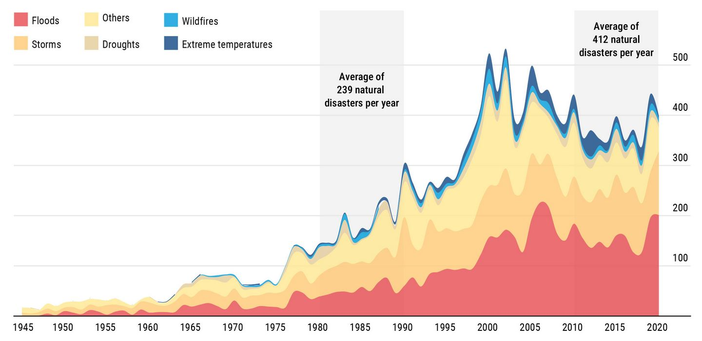

<div class="mcv-kicker">Seeed Solution · Mission Pack</div>

# 离网通信<br>Meshtastic

<div class="mcv-cover-subtitle">
高效应对灾害场景的开源 AIoT 实践解决方案
</div>

<div style="margin-top: 2.5rem; display: flex; gap: 0.6rem; flex-wrap: wrap;">
  <SeeedBadge icon="i-carbon:calendar">2025.06.14</SeeedBadge>
  <SeeedBadge icon="i-carbon:user-avatar">颜志鹏 (Spencer) · Seeed Solution</SeeedBadge>
</div>

<!--
所有人都已经体验过了 Meshtastic 的游戏和通信手段了。
玩了这些游戏之后，大家都已经对 Meshtastic 的使用非常娴熟了吧？

今天我们来做一个梳理、回顾。
-->

---
layout: section
---

# 微信不用，用这个？

<p>在没有深度使用 Meshtastic 之前，我一直有这个疑问。</p>

<div class="mcv-section-tags">
  <span>手机蓝牙连接模组</span>
  <span>软件上发送 LoRa 消息</span>
  <span>别人才能收到</span>
  <span>为什么不直接用微信？</span>
</div>

<!--
其实，在我没有深度使用 Meshtastic 之前，我一直有一个疑问。

Meshtastic？就是那个，用手机通过蓝牙连接，然后让模组发送 LoRa 报文，让别人看到你发的消息。

诶，那我为什么不用微信呢？

在徒步、滑雪、救灾的时候……大家想对这个曾经的我说些什么？
比如【什么情况下你会需要到 Meshtastic 呢？】

在没有蜂窝网络、Wi-Fi 或卫星服务覆盖的区域，Meshtastic 任然可以进行可靠通信。
-->

---
layout: intro
---

<div style="display: flex; align-items: center; gap: 3rem; width: 100%; max-width: 56rem;">
  <div style="display: flex; flex-direction: column; align-items: flex-start; min-width: 14rem;">
    <div style="width: 9rem; height: 9rem; border-radius: 50%; background: var(--mcv-green-soft); display: flex; align-items: center; justify-content: center; margin-bottom: 1.2rem; border: 3px solid var(--mcv-green-line); font-size: 3rem;">👤</div>
    <div style="font-size: 1.8rem; font-weight: 800; color: var(--mcv-ink);">颜志鹏</div>
    <div style="font-size: 1.3rem; font-weight: 600; color: var(--mcv-ink);">Spencer</div>
    <div style="font-size: 0.95rem; color: var(--mcv-muted);">Application Engineer</div>
    <div style="font-size: 0.85rem; color: var(--mcv-muted);">Seeed Solution</div>
  </div>

  <div style="flex: 1; display: flex; flex-direction: column; gap: 0.8rem;">
    <v-click>
    <div class="mcv-system-card" style="border-left: 4px solid var(--mcv-green);">
      <b>内容创作者</b>
      <strong>降低技术门槛</strong>
      <p>编写和维护 Wiki 内容，帮助全球开发者快速上手 Seeed 产品。</p>
    </div>
    </v-click>
    <v-click>
    <div class="mcv-system-card" style="border-left: 4px solid #3b82f6;">
      <b>应用工程师</b>
      <strong>从场景到解决方案</strong>
      <p>开发 Demos 和解决方案，用技术响应市场需求，推动业务增长。</p>
    </div>
    </v-click>
    <v-click>
    <div class="mcv-system-card" style="border-left: 4px solid #8b5cf6;">
      <b>嵌入式软件开发者</b>
      <strong>深入 Maker 生态</strong>
      <p>为用户提供从硬件到软件的一站式技术支持，探索前沿开源技术落地。</p>
    </div>
    </v-click>
  </div>
</div>

<!--
好，我叫颜志鹏。
目前是深圳矽递科技，解决方案团队的应用工程师。你也可以叫我 Spencer。

[click] 内容创作者
[click] 应用工程师
[click] 嵌入式软件开发者

这也是为什么我们会在 MissionPack 这个最小物联网单元套件里引入了 Meshtastic。
-->

---
layout: media
---

<div class="mcv-title-row">
  <h1>Seeed Solution · 我们是怎样做方案的</h1>
  <p>不坐在办公室里想象需求，而是深入真实场景。</p>
</div>

<div class="mcv-roles">

<v-clicks>

<div class="mcv-role-card">
  <b>一体化方案</b>
  <strong>软硬件集成</strong>
  <p>集成公司产品和技术，打造从硬件到软件的一体化解决方案，帮用户更快用起来。</p>
</div>

<div class="mcv-role-card">
  <b>倾听用户</b>
  <strong>深入真实痛点</strong>
  <p>深入了解用户在实际场景中的真实痛点，不是坐在办公室里想象需求。</p>
</div>

<div class="mcv-role-card">
  <b>前沿技术</b>
  <strong>开源 · 落地 · 实用</strong>
  <p>积极拥抱前沿开源技术，探索在真实场景中的应用落地。不为技术而技术。</p>
</div>

</v-clicks>

</div>

<!--
我们解决方案团队：

[click] 一体化方案——将公司产品和前沿技术打包，为用户提供从硬件到软件的完整解决方案。

[click] 倾听用户——积极面向真实场景，为客户排忧解难。

[click] 前沿技术——开源是刻在矽递科技基因里的。我们不会为了技术而技术，而是为了解决真实问题。

这也是为什么我们会在 MissionPack 里引入 Meshtastic。
-->

---
layout: media
---

<div class="mcv-title-row">
  <h1>需求就在身边</h1>
  <p>这个故事让我意识到，应急通信的需求是切切实实存在的。</p>
</div>

<div class="mcv-compare">
  <div class="mcv-side-note">
    <div class="mcv-kicker">WhatsApp · Chile, La Serena</div>
    <div class="mcv-quote" style="font-size: 0.95rem; line-height: 1.7;">
      Hello everyone, excuse the intrusion. I need to contact you to get that <strong>life-saving pack</strong>. Yesterday we had <strong>14 earthquakes</strong> in my region, not very significant from 3.5 to 5.4 MW, but in my city they happen all the time.<br><br>
      <strong>I have government contact to deploy it a test.</strong>
    </div>
    <p style="font-size: 0.78rem; color: var(--mcv-muted); margin-top: 0.5rem;">— 发送于地震发生后 2 小时</p>
  </div>
  <div class="mcv-side-note">
    <div class="mcv-kicker">WhatsApp · 智利 · 拉塞雷纳市</div>
    <div class="mcv-quote" style="font-size: 0.95rem; line-height: 1.7;">
      大家好，打扰了。我需要联系你们获取那个<strong>救命包</strong>。昨天我们地区发生了 <strong>14 次地震</strong>，震级从 3.5 到 5.4 级不等，虽然不算很强，但在我们城市这种情况经常发生。<br><br>
      <strong>我这边有政府联系人可以部署测试。</strong>
    </div>
    <p style="font-size: 0.78rem; color: var(--mcv-muted); margin-top: 0.5rem;">— Mission Pack 工作坊参与者</p>
  </div>
</div>

<!--
我的故事从这里开始。

这是一个智利的客户。他在 Whatsapp 上发了这么一条信息。

他是我们 Mission Pack 工作坊的一位参与者。
他想联系我们购买 Mission Pack，当出现自然灾害时，能够通过这个 Mission Pack 进行临时区域通信，达到应急响应处理。

这让我意识到，应急灾害救急的需求是切切实实存在的。
我无法想象我没有经历过的生活——在深圳，各种基础设施都非常完备。
-->

---
layout: section
---

# 当基础设施失效时……

<p>传统通信网络依赖电力和基站，一旦出现大规模故障，通信就会完全中断。</p>

<!--
说了那么多呢，我们这里抛开滑雪、徒步等场景，单独考虑应急通信。

我们生活在深圳，城市里各种基础设施协调运转。但如果基础设施出问题了，或者我们去了一个没有像我们这座城市那样的基础设施呢？

此时，你与外界的通信就直接断开了。
-->

---
layout: media
---

<div class="mcv-title-row">
  <h1>来回顾一下 2025 年发生的事</h1>
  <p>即使是现代化程度最高的地区，基础设施也可能瞬间失效。</p>
</div>

<div style="display: flex; flex-direction: column; gap: 0.7rem; height: calc(100% - 5.8rem); padding-top: 1rem; justify-content: center;">

<v-clicks>

<div class="mcv-system-card" style="border-left: 4px solid #f59e0b;">
  <b>🌩️ 2月 · 智利突发大规模停电</b>
  <strong>全国电网系统故障</strong>
  <p>影响数百万用户，通信网络大面积中断。与此同时，地震仍在持续发生。</p>
</div>

<div class="mcv-system-card" style="border-left: 4px solid #ef4444;">
  <b>⚡ 4月 · 伊比利亚半岛大停电</b>
  <strong>西班牙、葡萄牙全境受影响</strong>
  <p>欧洲历史上最大规模停电，跨国电网互联失效，地铁停运，交通信号熄灭。6000 万人陷入混乱。</p>
</div>

<div class="mcv-system-card" style="border-left: 4px solid #8b5cf6;">
  <b>🔌 5–6月 · 台湾多次大规模停电</b>
  <strong>地下电缆故障 + 变电站维护</strong>
  <p>影响数百万用户，台电砸 10 亿建置监控设备，但仍无法避免频繁停电影响通信基础设施。</p>
</div>

</v-clicks>

</div>

<!--
即使是今年，也是有大规模意外新闻。

[click] 2月，智利

[click] 4月，伊比利亚半岛
这是欧洲历史上最大规模的大停电，西班牙、葡萄牙、法国西南部全部受影响。欧洲的"模范生"。

[click] 台湾也如此。

这些都是今年发生的事件，感兴趣的也可以查一下。
-->

---
layout: media
---

<div class="mcv-title-row">
  <h1>气候相关灾害频发</h1>
  <p>从 2000 年到 2020 年，气候灾害数量呈明显上升趋势。</p>
</div>

<div style="flex: 1; margin-top: 1rem; min-height: 0;">
  
</div>
<p style="font-size: 0.7rem; text-align: right; color: var(--mcv-muted); margin-top: 0.3rem;">来源：<a href="https://www.un.org/en/content/action-agenda-on-internal-displacement/climate-related-disasters.shtml">联合国气候相关灾害数据</a></p>

<!--
这张图来源于联合国气候相关灾害数据。

从2000年到2020年，气候灾害的数量呈现明显的上升趋势。
特别是洪水、风暴和干旱等极端天气事件显著增加。

这些灾害不仅造成人员伤亡，还会导致通信基础设施被破坏。
这提醒我们：应急通信系统的重要性，以及需要更可靠的备用通信方案。
-->

---
layout: media
---

<div class="mcv-title-row">
  <h1>灾害发生时的四个核心挑战</h1>
  <p>每一个都是传统通信方案的盲区。</p>
</div>

<div style="display: grid; grid-template-columns: 1fr 1fr; gap: 0.8rem; height: calc(100% - 5.8rem); padding-top: 1rem;">

<v-clicks>

<div class="mcv-system-card" style="border-top: 3px solid #ef4444;">
  <b>🚨 应急通信断点</b>
  <strong>传统网络首先失效</strong>
  <p>灾害发生时，蜂窝基站、光缆依赖电力，往往第一个失效。救援团队和受困人员无法建立有效通信。</p>
</div>

<div class="mcv-system-card" style="border-top: 3px solid #f59e0b;">
  <b>⏱️ 黄金救援时间</b>
  <strong>前 72 小时最关键</strong>
  <p>灾害救援的前 72 小时是黄金时间，快速部署通信设备对于协调救援至关重要。</p>
</div>

<div class="mcv-system-card" style="border-top: 3px solid #3b82f6;">
  <b>🗺️ 地理环境挑战</b>
  <strong>偏远地区本来就弱</strong>
  <p>山区、偏远地区通信基础设施本来就薄弱，需要能自主组网的通信方案。</p>
</div>

<div class="mcv-system-card" style="border-top: 3px solid #8b5cf6;">
  <b>🔧 开箱即用要求</b>
  <strong>不能需要专业培训</strong>
  <p>现有应急通信设备操作复杂，需要专业培训。灾害发生时没有时间学习配置。</p>
</div>

</v-clicks>

</div>

<!--
在灾害发生时，通常会有哪些问题？

[click] 依赖蜂窝网络等基站的方式可能已经失效。

[click] 需要在短时间内快速使用，快速建立备用通信渠道，在不同点位上快速组网。

[click] 无需网络维护，不用像电信公司那样经常派人进行网络维护。

[click] 需要开箱即用，不需要复杂的配置，只需要简单会用就可以了。
-->

---
layout: media
---

<div class="mcv-title-row">
  <h1>Mission Pack 能做什么？</h1>
  <p>引入 Meshtastic 之后，应对四种核心场景。</p>
</div>

<div style="display: grid; grid-template-columns: 1fr 1fr; gap: 0.8rem; height: calc(100% - 5.8rem); padding-top: 1rem;">

<v-clicks>

<div class="mcv-system-card" style="border-left: 4px solid #ef4444;">
  <b>🚨 灾害现场</b>
  <strong>应急通信保障</strong>
  <p>快速部署应急通信网络 · 救援队伍实时协调 · 灾情信息实时共享 · 救援物资调度管理</p>
</div>

<div class="mcv-system-card" style="border-left: 4px solid var(--mcv-green);">
  <b>🏔️ 偏远山区</b>
  <strong>户外探险支持</strong>
  <p>登山队伍通信保障 · 恶劣天气预警系统 · 紧急求救信号发送 · 基站无覆盖区域通信</p>
</div>

<div class="mcv-system-card" style="border-left: 4px solid #8b5cf6;">
  <b>🏘️ 社区应急</b>
  <strong>邻里互助网络</strong>
  <p>停电时的通信备份 · 社区安全信息共享 · 老人儿童看护提醒 · 自然灾害预警传播</p>
</div>

<div class="mcv-system-card" style="border-left: 4px solid #f59e0b;">
  <b>🔬 科学研究</b>
  <strong>野外科考支持</strong>
  <p>环境数据实时采集 · 科考队伍协调通信 · 偏远地区数据传输 · 长期监测站点部署</p>
</div>

</v-clicks>

</div>

<!--
引入 Meshtastic 之后，Mission Pack 能够应对哪些场景？

[click] 在灾害现场，你可以快速搭建起整个应急通信所需要的链路。

[click] 在偏远山区，不再依赖运营商的网络通信，在良好视距距离直接进行超远信息传输。

[click] 在社区里，可以防范于未然。不同的是，你不需要专业技术就能直接进行通信操作。

[click] 结合物联网场景，在野外没有良好基础设施支持的场景下进行数据采集、给工作队伍提供通信支持。
-->

---
layout: media
---

<div class="mcv-title-row">
  <h1>Meshtastic 为什么能做到这些</h1>
  <p>三个技术基础，缺一不可。</p>
</div>

<div class="mcv-roles">
  <div class="mcv-role-card">
    <b>📡 LoRa 物理层</b>
    <strong>远距离 · 低功耗</strong>
    <p>基于 LoRa 无线电协议，在免许可频段上实现数公里通信。低功耗特性支持长期野外部署。</p>
  </div>
  <div class="mcv-role-card">
    <b>🕸️ 网状网络 (Mesh)</b>
    <strong>无中心 · 自修复</strong>
    <p>网络中每个节点都能充当中继，自动转发消息，极大扩展覆盖范围。无需中央服务器，网络动态自我修复。</p>
  </div>
  <div class="mcv-role-card">
    <b>🔒 信道与 AES 加密</b>
    <strong>私密 · 安全</strong>
    <p>通过设置信道名称和预共享密钥 (PSK) 创建逻辑私密群组。所有通信经过 AES 加密，确保安全与私密。</p>
  </div>
</div>

<!--
Meshtastic 因为什么提供了可能？

[click]

它基于 LoRa 物理层，所以能做到远距离、低功耗通信，在免许可频段上工作。

网状网络意味着每个节点都是中继，覆盖范围可以自动扩展，无需中心节点。

AES 加密保证了通信的私密性和安全性。
-->

---
layout: media
---

<div class="mcv-title-row">
  <h1>开发者生态：多语言 SDK 支持</h1>
  <p>快速集成到各类应用，无论你熟悉什么语言。</p>
</div>

<div class="mcv-compare">
  <div class="mcv-side-note">
    <div class="mcv-kicker">发送消息（Python 示例）</div>

```python
import meshtastic.serial_interface

interface = meshtastic.serial_interface.SerialInterface('/dev/ttyUSB0')

# 广播消息
interface.sendText("Hello from Python!")

# 定向发送给特定节点
interface.sendText("Private message", destinationId="!abcdef12")
```

  </div>
  <div class="mcv-side-note">
    <div class="mcv-kicker">接收消息（订阅回调）</div>

```python
from pubsub import pub

def onReceive(packet, interface):
    if 'decoded' in packet:
        portnum = packet['decoded']['portnum']
        if portnum == 'TEXT_MESSAGE_APP':
            msg = packet['decoded']['payload'].decode('utf-8')
            print(f"收到: {msg}")

pub.subscribe(onReceive, "meshtastic.receive")
```

  <div class="mcv-kicker" style="margin-top: 0.8rem;">支持的 SDK 生态</div>
  <ul>
    <li>Python SDK · 适合 IoT 自动化集成</li>
    <li>JavaScript 库 · 适合 Web 应用和 Node-RED</li>
    <li>命令行工具 · 适合快速调试和脚本</li>
  </ul>
  </div>
</div>

<!--
我们拿 Python 的串口举例子。

首先导入包，创建一个实例，指定串口。
然后你就可以通过 Python 去发送 Meshtastic 消息了，也可以指定要发送的目标节点。

接收这边，Meshtastic 提供了一种订阅的方式来实现回调处理——
这样你可以把更多时间放在应用业务上，不用管底层的接收和发送逻辑。
-->

---
layout: end
---

# 离网通信，现在可以动手了。

<p class="mcv-end-statement">从智利地震现场的那条消息开始，到你手上的这套 Mission Pack。</p>

<div class="mcv-end-links">
  Meshtastic 官网：meshtastic.org<br>
  Mission Pack 了解更多：seeedstudio.com<br>
  GitHub: github.com/Love4yzp
</div>

<!--
收尾回到一句话：Meshtastic + Mission Pack，是一套让你在基础设施失效时仍然保持连接的方案。

从智利那条地震后 2 小时发来的消息开始，需求就一直在那里。
现在轮到你动手了。

谢谢大家。
-->
