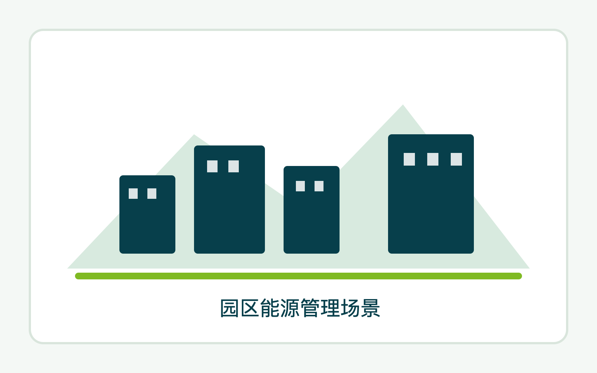
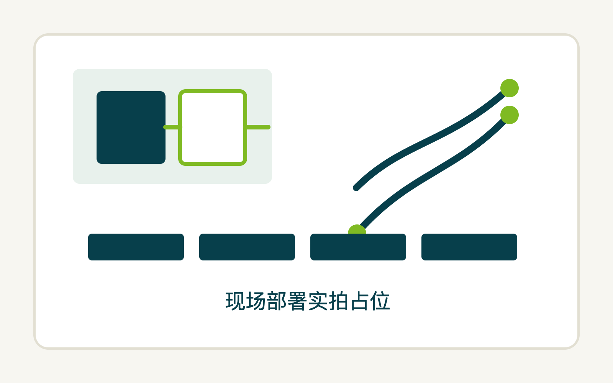
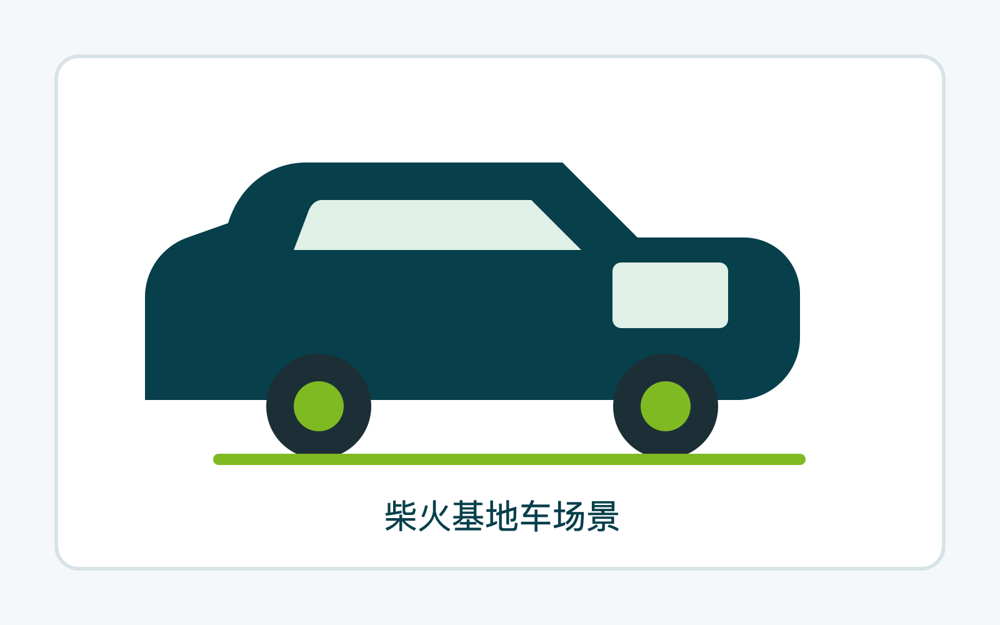

Seeed Studio 方案团队 · 实践分享

# HA + AI Agent

商业落地经验与 AI 交互体验探索 
从设备接入到意图驱动

  <SeeedBadge icon="i-carbon:calendar">2026.03.14 · 深圳</SeeedBadge>
  <SeeedBadge icon="i-carbon:user-avatar">颜志鹏 (Spencer) · Seeed Studio</SeeedBadge>

<!--
大家好，我是志鹏，来自 Seeed Studio 的方案团队。

方案呢，顾名思义就是解决方案，我们是矽递科技产品的首位用户，结合硬件优势帮助更多用户更好、更快地用起来。

今天分享三件事。
-->

---
layout: media
---

  <h1>今天讲三件事</h1>
  
从商业实践到 AI 探索，最后是一个有意思的预告。

  

    

      <b>01</b>
      <strong>用 HA 管了一个商业综合体</strong>
      
园区能源管理的真实落地经验，包括能力边界和系统架构。

    

  

  

    

      <b>02</b>
      <strong>AI Agent 让 HA 更好用</strong>
      
从写规则到说意图，交互方式正在发生根本变化。

    

  

  

    

      <b>03</b>
      <strong>把 HA 装进了一辆 VAN</strong>
      
HA 不只能管商场——它是任何有设备空间的操作系统。

    

  

<!--
第一件事，我们用 HA 管了一个商业综合体。
第二件事，结合 AI Agent 把 HA 的交互方式往前推一大步。
第三件事，我们还把 HA 装进了一辆 VAN——你会发现 HA 好像也不只是"智能家居"那点事了。
-->

---
layout: media
---

  <h1>园区能源管理：真实的商业项目</h1>
  
低成本、开放、跨品牌——这是客户的三个核心要求。

  

    
项目场景

    

      
<b>🏬</b><strong>商场</strong>

      
<b>🏢</b><strong>办公楼</strong>

      
<b>🏠</b><strong>公寓</strong>

      
<b>⚡</b><strong>充电桩</strong>

    

    
核心能力

    <ul>
      <li>跨品牌设备集成 · 能耗数据可视化</li>
      <li>非关键逻辑自动化 · 统一操作界面</li>
    </ul>
    
系统边界

    
消防 / 电梯 / 高压配电——仅状态监视，不反控

    
硬件：reComputer R1000 边缘网关 + XIAO Energy Meter 非侵入式用电监测

  

  

    
  

<!--
去年我们支持了一个合作方，做的是一个商业综合体的低成本能源管理。
里面有商场、办公楼、公寓、充电桩——设备品牌多，系统很杂，管理很碎。

我们在里面做的事情，核心不是追求特别炫的功能，而是把跨品牌设备接进来，把能耗数据看清楚，把一些非关键逻辑做成自动化，再给现场一个统一的操作界面。

边界也很重要：像消防、电梯、高压配电这些，只看状态，不做反控。
-->

---
layout: media
---

  <h1>现场部署实拍</h1>
  
真正在现场跑起来的东西，不是 PPT 里的示意图。

  

<!--
快速过一下现场照片，增加可信度。不用每张细讲，让听众感受到"真的做过"就行。
-->

---
layout: media
---

  <h1>系统跑起来了，但是——</h1>
  
能跑不等于好用，这是我们发现的真正瓶颈。

  

    
系统能做的事

    <ul>
      <li>跨品牌设备统一管理</li>
      <li>能耗数据实时可视化</li>
      <li>远程监控，不用到现场</li>
      <li>自动化规则覆盖常见场景</li>
    </ul>
  

  

    
真正的瓶颈

    
理解「实体」「服务」「自动化触发」这些概念，对初学者来说并不容易。

    

      系统跑起来了，<strong>用起来还是有门槛</strong>。
    

    
围绕这个问题，我们做了两件事。

  

<!--
系统跑起来以后，它已经能做不少事情了。
但问题很快就出来了：系统会做，不等于人会用。

"实体""服务""自动化触发"这些概念，对不天天折腾的人来说是有门槛的。
所以真正的瓶颈可能不在设备接得上接不上，而在于人有没有办法轻松用起来。
-->

---
layout: section
---

# 第一件事：把经验变成课程

很多人不是对这个方向没兴趣，而是一上来就被门槛劝退了。

<!--
因为我们发现，很多人不是不想学，而是第一步迈太大了。
需要一张地图，告诉他怎么开始。
-->

---
layout: media
---

  <h1>柴火创客学院课程体系</h1>
  
把台阶搭出来，而不是让每个人自己摸索。

  

    <b>L1 展示层</b>
    <strong>单点体验</strong>
    
开箱即用、零代码体验，快速建立感性认知。让决策者「看得懂」。

  

  

    <b>L2 顾问层</b>
    <strong>场景联动</strong>
    
设备连接与自动化配置，HA / Node-RED 联动。让运维人员「搭得了」。

  

  

    <b>L3 设计层</b>
    <strong>业务集成</strong>
    
API 对接、模型训练、私有化部署，商业闭环。让开发者「扩展得动」。

  

  很多人不是学不会，而是第一步迈太大了——所以先把台阶搭出来。

<!--
我们在柴火创客学院，把这套东西拆成了三层。

第一层是展示层。先别讲复杂的，先让大家体验，先有感觉。
第二层是顾问层。开始讲设备怎么连、自动化怎么配。
第三层才是设计层。API 对接、模型训练、私有化部署。

我自己的感觉是，很多人不是学不会，而是第一步迈太大了。
-->

---
layout: section
---

# 第二件事：AI Agent 这个新变量

它真正有意思的地方，不是"它很火"——而是它可能真的会改掉 HA 一些原来很难用的地方。

<!--
第二件事，就是 AI Agent。
这个东西这两年大家都在聊，但对我来说，它真正有意思的地方，
不是"它很火"，而是它可能真的会改掉 HA 一些原来很难用的地方。
-->

---
layout: media
---

  <h1>从「写规则」到「说意图」</h1>
  
用户体验上最根本的变化。

  

    
以前：配置 HA 自动化

    <ul>
      <li>写触发条件、写判断逻辑</li>
      <li>调延迟定时器、调状态确认</li>
      <li>一个场景一条规则，十个场景十条规则</li>
    </ul>
    

      规则越多，越怕改。
    

  

  

    
现在：Agent 理解意图

    <ul>
      <li>「准备看电影」→ Agent 判断：关灯、拉窗帘、调电视</li>
      <li>「帮我查今天的异常用电」→ Agent 自己查数据、生成报告</li>
    </ul>
    

      不用写规则，说人话就行。
    

  

  已有工具如 OpenClaw、NanoClaw 可通过 WhatsApp / Telegram 直接与家交互

<!--
以前如果你想把 HA 用顺手，很多时候其实是在"写规则"。
规则越堆越多，你就开始怕改。因为你不知道动这一条，会不会把另外三条带崩。

Agent 带来的变化，核心就是把"写规则"变成"说意图"。
你说"准备看电影"，不用先想清楚到底关哪盏灯、拉哪层窗帘。Agent 自己去理解、自己去拆动作。
-->

---
layout: media
---

  <h1>从你找设备，到设备找你</h1>
  
交互方式的四个演进阶段。

<v-clicks>

  

    <b>阶段 1</b>
    <strong>Dashboard</strong>
    
打开 App，找设备，点按钮。完整但对人有要求——得知道设备在哪。

  

  

    <b>阶段 2</b>
    <strong>语音助手</strong>
    
"小爱，开灯"——比 Dashboard 更自然，但命令要足够明确才能理解。

  

  

    <b>阶段 3</b>
    <strong>IM + 意图</strong>
    
"准备看电影"—— Agent 自己判断：关灯、拉窗帘、切电视模式。

  

  

    <b>阶段 4</b>
    <strong>主动推送</strong>
    
系统定期巡检，发现异常，主动推消息给你。你不用再主动盯着了。

  

</v-clicks>

  以前得自己盯 Dashboard——以后系统自己盯着，有问题直接推给你。

<!--
如果把整个交互方式拉开看，它大概经历了几个阶段。

Dashboard → 语音助手 → IM + 意图 → 主动推送

整个方向是从"你去找设备"，走到"设备来找你"。

以前是你自己盯着 Dashboard，看有没有异常。
以后更自然的方式应该是系统自己盯着，发现问题以后直接来找你。
-->

---
layout: media
---

  <h1>不只在屏幕里：Agent 的眼睛和耳朵</h1>
  
配合硬件设备，Agent 能看、能听、能感知现场环境。

  

    
SenseCAP Watcher · Seeed Studio

    <ul>
      <li>摄像头 + 麦克风 + 本地 AI 推理</li>
      <li>感知环境变化，主动触发交互</li>
      <li>通过 MCP 接入 HA，调用设备服务</li>
    </ul>
    

      仓管演示：识别人员 → 查库存 → 更新状态，全程自动
    

  

  

    
Reachy Mini 等躯体设备

    <ul>
      <li>同样具备视觉和听觉感知</li>
      <li>Agent 在物理世界的另一种形态</li>
      <li>伴随情绪价值交互，不只是指令执行</li>
    </ul>
    

      交互终端在扩展——不只是屏幕和音箱
    

  

<!--
当 Agent 跟硬件结合起来，它就开始有眼睛、有耳朵，甚至某种程度上，有了身体。

SenseCAP Watcher 这种设备，本质上就是摄像头、麦克风，加上本地 AI 推理能力。
它先感知环境变化，再通过 MCP 去接 HA，触发后面的动作。

Reachy Mini 有动作、有反馈，带来情绪价值交互。
以后的交互终端，不会只剩屏幕和音箱。
-->

---
layout: media
---

  <h1>AI Agent 改变了什么体验</h1>
  
三个关键变化，对普通用户最有感知的部分。

<v-clicks>

  <b>变化 1</b>
  <strong>从写规则到说意图</strong>
  
不用学 YAML、不用调定时器——说人话，Agent 自己拆解成动作。门槛大幅降低。

  <b>变化 2</b>
  <strong>从你找设备到设备找你</strong>
  
交互入口从 Dashboard 迁移到 IM 和主动推送——设备会主动来找你。

  <b>变化 3</b>
  <strong>Agent 不只在屏幕里</strong>
  
配合摄像头、麦克风、传感器，Agent 能看懂现场环境，不只是等你发消息。

</v-clicks>

<!--
对于普通用户体验的三个核心变化。

第一件事，从写规则变成说意图。门槛一下就低了很多。
第二件事，从你找设备，慢慢变成设备找你。
第三件事，Agent 不只在屏幕里。它开始通过摄像头、麦克风、传感器去理解现场。
-->

---
layout: section
---

# HA 不只能管商场

它更像是一套可以管理任何有设备空间的操作系统。

<!--
说了这么多，回到那个预告。
HA 在我心目中，已经是一个名义上的万物物联网系统，不只是建筑、家居，也是一个空间的天网系统。
-->

---
layout: media
---

  <h1>柴火基地车：把 HA 装进一辆 VAN</h1>
  
商场是一个空间，家是一个空间，一辆开往旷野的 VAN 也是一个空间。

  

    
车上有什么

    <ul>
      <li>边缘算力 · 传感器 · LoRaWAN 基站</li>
      <li>数字制造设备</li>
      <li>电力、环境、通信——全部接入 HA</li>
    </ul>
    
去哪里

    
开进没有网络的地方，和当地人一起用技术解决他们遇到的真实问题。

    

      和管商场一样——HA 是这辆车在旷野的操作系统。
    

  

  

    
  

<!--
我们做了一件更有意思的事，就是把 HA 装进一辆 VAN。

商场是一个空间，家是一个空间，一辆开往旷野的 VAN，其实也是一个空间。
车上有边缘算力、传感器、LoRaWAN 基站，还有数字制造设备。
电力、环境、通信这些状态，全部都可以接进 HA。

它会去一些没有网络、没有现成基础设施的地方，跟当地人一起解决他们真正碰到的问题。

从这个角度再回头看，会发现 HA 在这里扮演的角色，跟在商场里没有本质区别——它还是这个空间的操作系统。
-->

---
layout: end
---

# 谢谢大家

HA 是任何有设备空间的操作系统。

  了解 Seeed Studio 智慧空间方案：seeedstudio.com.cn/solutions 
  柴火创客学院课程：扫码或联系社区经理

<!--
前面讲了商业项目，讲了课程体系，也讲了 Agent 的交互探索。
表面上看是三件事，其实都在回答同一个问题：
怎么把空间里的这些设备，慢慢变成一个更容易被理解、更容易被使用、也更能主动协作的系统。

谢谢大家。
-->
