
柴火数字基地车 · 第一程复盘

# 拓荒 · 火种

把 AI、开源硬件和真实问题带到现场 
开到哪里，哪里就是基地

<a href="http://mcv.chaihuo.org" target="_blank" rel="noopener noreferrer">mcv.chaihuo.org</a> 
<a href="https://www.yuque.com/mouseart/mcv" target="_blank" rel="noopener noreferrer">yuque.com/mouseart/mcv</a>

<!--
旁白：
今天不先讲车上有什么设备，而是先讲这辆车为什么要出发。
“拓荒”不是把标准答案送到每个地方，而是把 AI 和开源硬件带到现场，让真实问题自己冒出来。
这趟路里最打动我的，不是我们展示了多少技术，而是有些人因此开始相信自己也可以用技术解决问题。
-->

---
layout: media
---

  <h1>今天讲三件事</h1>
  
先进入路线，再看三颗火种，最后回到我们被现场改掉的判断。

  

    

      <b>01</b>
      <strong>拓荒路线</strong>
      
第一程从深圳出发，一路把同一套方法带进不同现场。

    

  

  

    

      <b>02</b>
      <strong>三颗火种</strong>
      
玉林馆长、柳州新农人、贵阳研究生导师，三种不同的连接。

    

  

  

    

      <b>03</b>
      <strong>现场改题</strong>
      
产品、课程和下一段路线，都要被真实问题重新校准。

    

  

<!--
旁白：
今天我会按三层来讲。第一层是路线，我们到底去了哪里。
第二层是人，哪些人在现场把这件事接住了。
第三层是我自己的变化，为什么走完以后，我对产品、教育和农业场景的理解都被改了一遍。
-->

---
layout: media
---

  <h1>拓荒不是把答案送过去</h1>
  
第一程最重要的收获，是把技术想象放回现场里验证。

  

    
出发前

    <ul>
      <li>把改装后的柴火数字基地车开到真实场景里</li>
      <li>去边远地区找被技术忽略的生产和教育问题</li>
      <li>让工程师、老师、学生、村民在现场共创方案</li>
      <li>用低成本、可复制的方式验证 AI 能不能解决小问题</li>
    </ul>
  

  

    
到了之后

    
真正的问题不是“大家知不知道 AI”，而是：

    

      他们不一定相信 AI 是为自己准备的，也不一定知道自己可以从这里开始使用它。
    

  

<!--
旁白：
出发前，我们会以为这是一场技术下乡，车开过去，设备摆出来，工作坊开起来。
但到了现场才发现，真正需要被解决的不是“大家知不知道 AI”。
很多人其实听过 AI，只是没有足够具体的入口，也不确定这件事和自己有什么关系。
-->

---
layout: media
---

  

    <h1>第一程路线</h1>
    
深圳出发，一路向西北，把同一套方法带到不同现场里检验。

  

  

    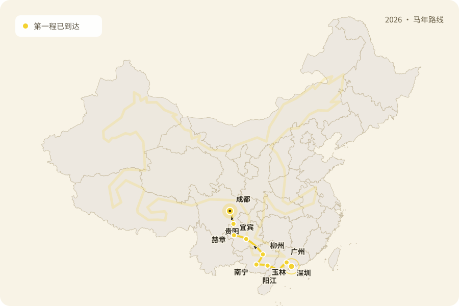
  

  

    深圳
    广州
    阳江
    玉林
    南宁
    柳州
    贵阳
    赫章
    宜宾
    成都
  

<!--
旁白：
第一程从深圳出发，一路经过广州、阳江、玉林、南宁、柳州、贵阳、赫章、宜宾，最后到成都。
这张图不是为了证明我们跑了多远，而是为了说明：同一辆车、同一套方法，放到不同地方会被问出完全不同的问题。
路线越往外走，信息差、资源差和场景差就越具体。
-->

---
layout: media
---

  <h1>每到一处，我们做什么</h1>
  
车停下来，就把展示、动手和反馈放进同一个现场。

  

    
现场动作

    <ul>
      <li>展开车上的展示空间</li>
      <li>讲清基地车里的 AI、机器人和开源硬件方案</li>
      <li>开 M0 工作坊，让参与者用自然语言完成一个可运行的小应用</li>
      <li>收集反馈，继续修改产品展示和培训体验</li>
    </ul>
  

  

    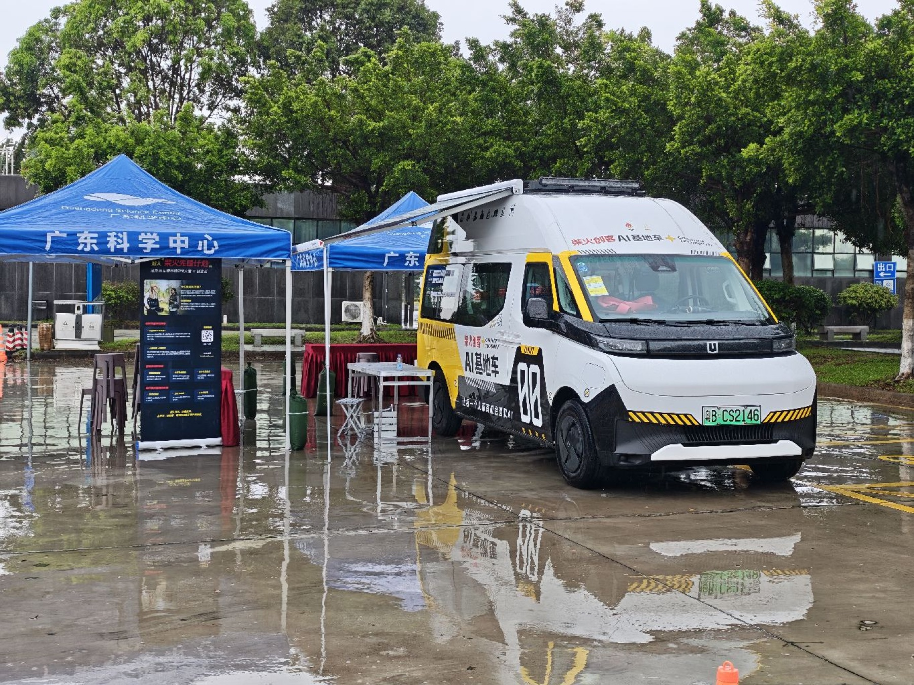
    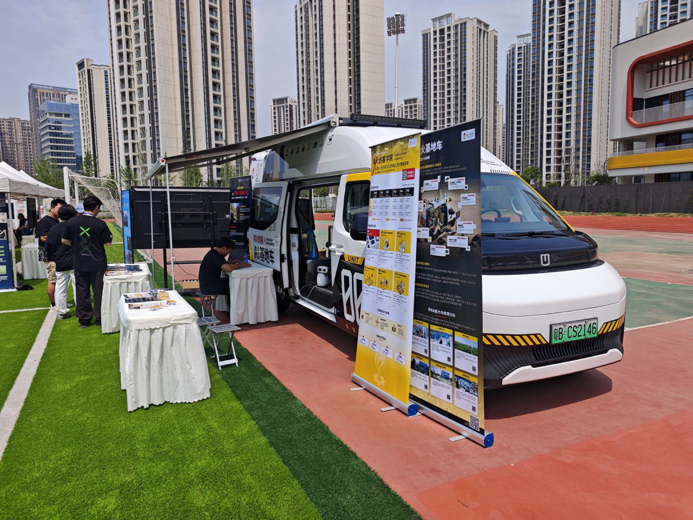
  

<!--
旁白：
每到一站，车停下来以后，它就不只是交通工具了。
它会变成一个临时的展示空间、课堂和反馈现场。
我们一边展示设备，一边带大家动手做一个小应用，也一边记录他们真正卡在哪里。
-->

---
layout: media
---

  <h1>火种一：玉林科技馆馆长</h1>
  
一个工作坊结束后，合作对话才真正开始。

  

    
工作坊结束当晚，外面已经快黑了，馆长还拉着冯老师去找懂行的技术人，当场谈 AI 教育合作，也请我们吃饭。

    

      你们带来了传家宝、宝藏啊。
    

    <ul>
      <li>青年科创教育需要懂应用、能解决问题的人才</li>
      <li>AI 可以让教育更生动、有趣</li>
      <li>它能补上有限理论和有限教师资源之外的实践入口</li>
    </ul>
  

  

    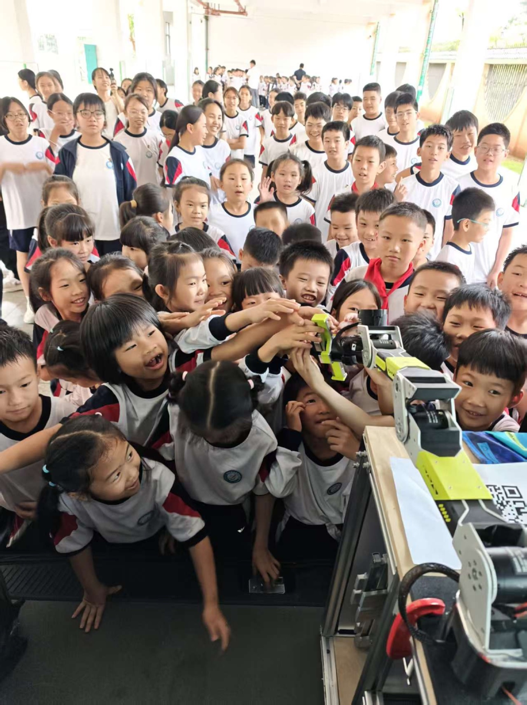
    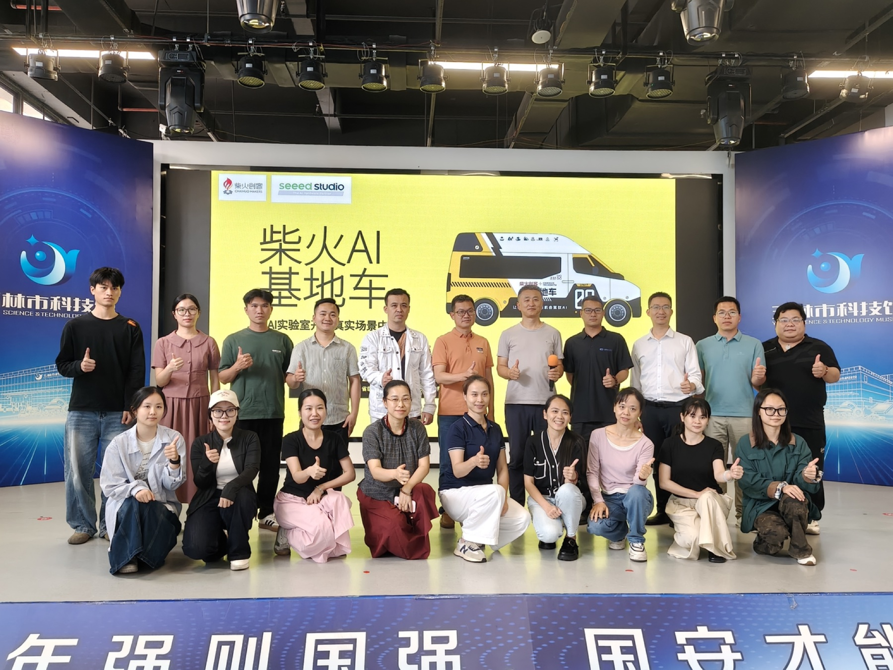
  

<!--
旁白：
玉林这一站最重要的不是工作坊本身，而是工作坊之后发生的事。
天快黑了，馆长还拉着我们去找懂技术的人，当场聊 AI 教育合作。
他说“你们带来了传家宝、宝藏啊”，这句话让我意识到，我们以为很基础的东西，在当地可能就是他们继续往前走的入口。

日记：https://www.yuque.com/mouseart/mcv/gp0di92ghrxehzxp
-->

---
layout: media
---

  <h1>火种二：柳州三都镇的新农人</h1>
  
在地伙伴让技术语言接上土地和农民的顾虑。

  

    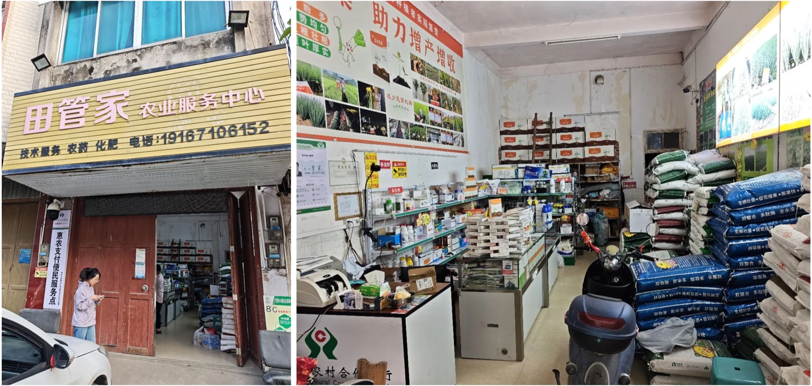
    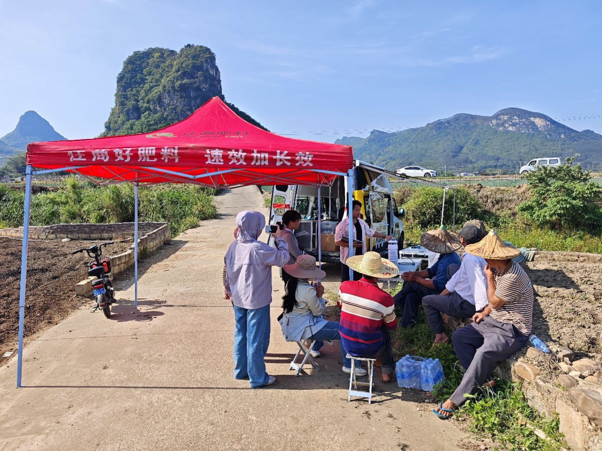
  

  

    
梁彩梅老师从华中农大毕业后回乡创业。她的店里经营农业化肥产品，也有 SenseCAP 系列产品；两年前的气象站，她现在还在用。

    
她在这次行程里的角色很关键：

    <ul>
      <li>她懂土地的语言，也懂农民的顾虑</li>
      <li>她帮我们和本地散户农民搭桥</li>
      <li>她让我们带着方案去找问题，也带走哪些适合做、哪些暂时不做的边界</li>
    </ul>
  

<!--
旁白：
柳州这一站，如果没有梁老师，我们很难直接和本地农民建立有效对话。
她既懂农业，也懂本地农民的顾虑，所以她不是简单带路，而是在帮我们翻译场景。
这也提醒我们，技术方案进入真实场景，很多时候需要一个在地的人先把信任搭起来。

日记：https://www.yuque.com/mouseart/mcv/gzlp7usk115m7dns
-->

---
layout: media
---

  <h1>农民真正要的不是模型</h1>
  
设备只是证据，真正的答案要能被几亩地直接使用。

  

    
在柳州，我们才知道种葱需要什么样的土壤温度，每年虫害和农药的节奏是怎样的。

    
本地散户维护的是几亩地，很多时候靠经验和天气吃饭。他们不关心传感器、模型、平台，也不需要先理解 AI 原理。

    
他们问的是更直接的问题：

    

      有没有一个小程序，告诉我什么时候浇水、什么时候撒药？ 
      或者干脆帮我浇水？
    

    
数据是给系统看的；人要的是一个能直接执行的判断。

  

  

    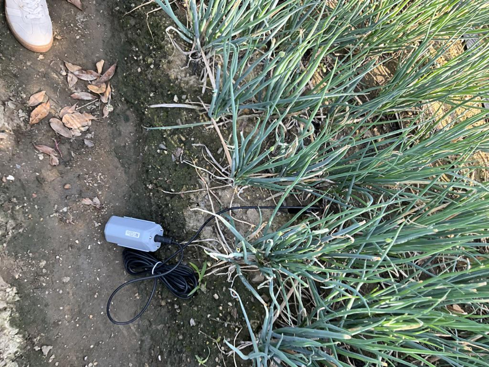
    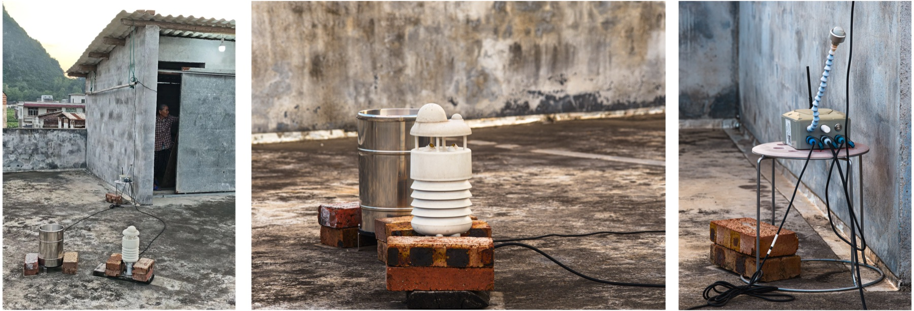
  

<!--
旁白：
这页我想强调的是，农业用户并不是想要一个“AI 系统”。
他们想要的是一个明确答案：什么时候浇水，什么时候撒药，或者能不能直接帮我浇水。
传感器数据、模型和平台都重要，但它们应该在系统背后工作，最后给到人的应该是能执行的判断。
-->

---
layout: media
---

  <h1>火种三：贵阳的研究生导师</h1>
  
不是让老师更熟练地复制代码，而是让路径变短。

  

    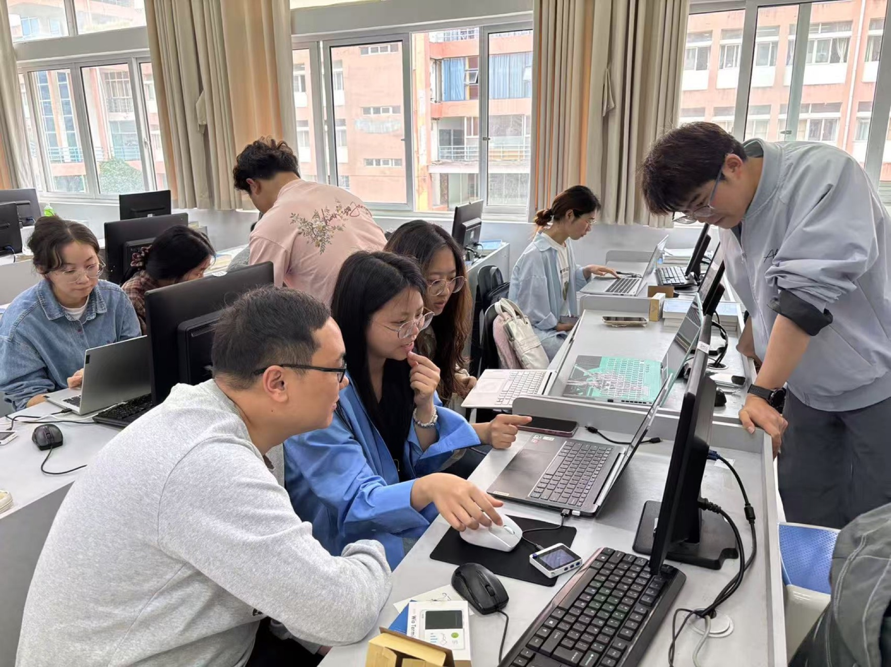
    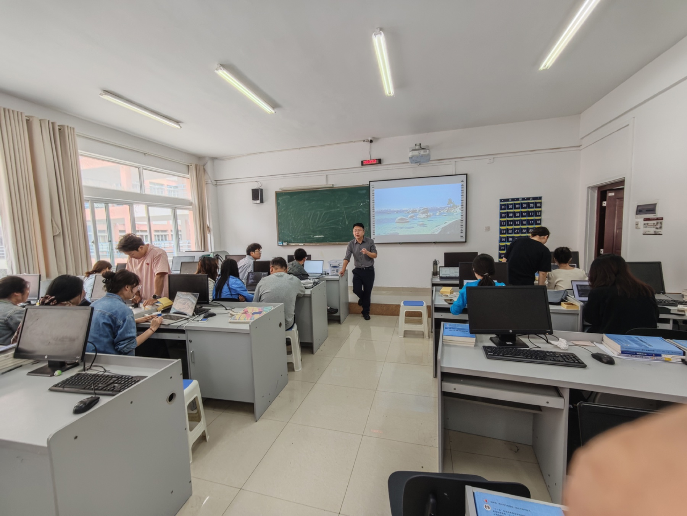
  

  

    
这天去了贵州师范学院和贵州大学。何老师在工作坊前一段时间还在给研究生上课，方式是 DeepSeek 生成代码，再复制、粘贴、试错。

    
他是重度 Arduino 用户，熟悉串口屏和工业方向应用；这次简单的工作坊，让他体验到真正的 AI 编程。

    
不是他不够强，而是从来没有人告诉他可以有更短的路。

    

      从“复制粘贴代码”到“用意图驱动应用”，Vibe Coding 真的跑起来了。
    

  

<!--
旁白：
贵阳这一站让我印象很深的是何老师。
他本身并不弱，甚至是重度 Arduino 用户，也熟悉串口屏和工业应用。
但他使用 AI 编程的方式，还停留在生成代码、复制粘贴、再一点点试错。工作坊之后，他看到原来可以直接用意图驱动工具，这条路一下子变短了。

日记：https://www.yuque.com/mouseart/mcv/ykbof5ti7dbcprgg
-->

---
layout: media
---

  <h1>M0 工作坊的规则</h1>
  
方法论核心页：讲慢一点，让观众理解为什么要反常识地禁止手写代码。

  

    
Vibe Coding

    <h2>严禁人工写代码。</h2>
    

      
不会写代码，不是进入 AI 时代的门槛

      
自然语言可以驱动工具

      
关键能力从“手写实现”转向“表达意图、判断结果、持续修正”

    

  

  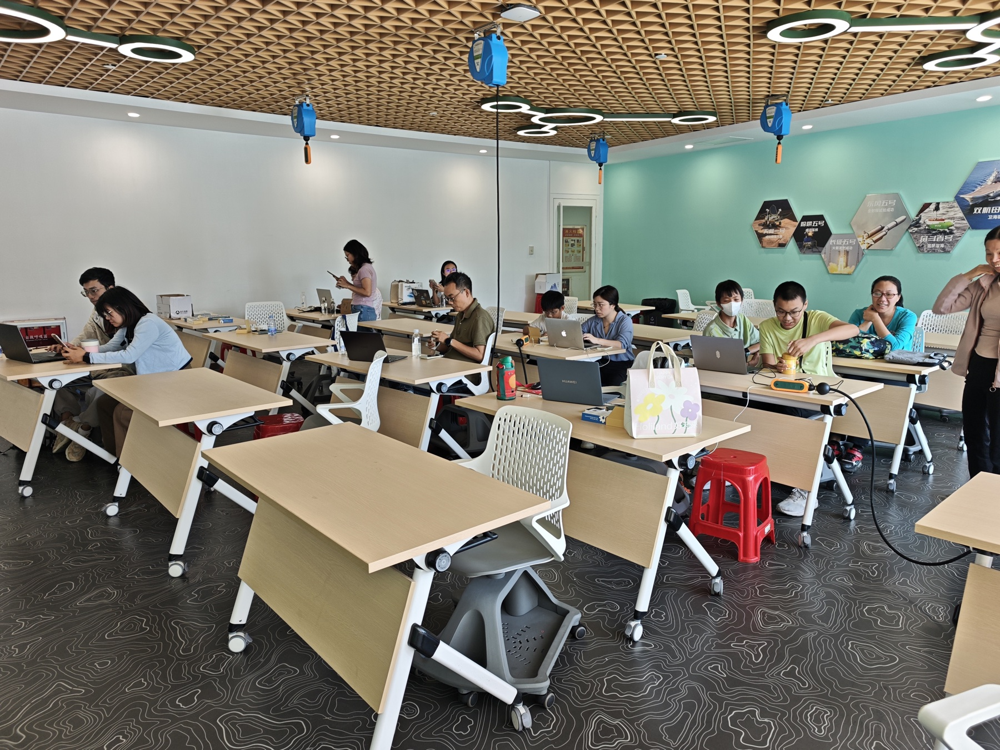

<!--
旁白：
M0 工作坊有一个很反常识的规则：严禁人工写代码。
它不是在否定编程能力，而是在把门槛重新定义。
在这个阶段，关键能力不是谁手写实现最快，而是谁能把意图讲清楚，判断结果对不对，并且持续修正。
-->

---
layout: media
---

  <h1>我的感受一：产品要被讲清楚</h1>
  
真正拓荒之后，产品问题会从口号变成面对面的追问。

  

    <b>被问住</b>
    <strong>机械臂能干什么？</strong>
    
我只能先说具身智能、教育场景。这让我意识到，我对自己的产品了解得还不够。

  

  

    <b>找联想</b>
    <strong>从“胡闹厨房”讲到火锅</strong>
    
我会借最近做过的黑客松和火锅演示，让他们先联想到“它也许能做什么”。

  

  

    <b>锻炼</b>
    <strong>把价值讲到被看见</strong>
    
一个暂时说不清楚用途的产品，怎么让人看见它的价值？这件事只能在交流里练出来。

  

产品不是摆在那里就会被理解，它需要被放进一个别人能想象的任务里。

<!--
旁白：
这趟路第一个刺痛我的地方，是我发现自己对产品的理解还不够。
机械臂摆在那里，有人问“能干什么”，我很容易只能说具身智能、教育场景。
后来我会借“胡闹厨房”和火锅黑客松，让他们先产生画面感。这个过程其实是在训练我：一个还没被定义清楚的产品，怎么把价值讲到别人能看见。
-->

---
layout: media
---

  <h1>我的感受二：他们接收到的是信心</h1>
  
我们以为在输出技术，但现场收到的常常是“原来我也可以”。

  

    <b>节奏差</b>
    <strong>离一线城市越远，节奏越不一样</strong>
    
他们不是不知道 AI，而是没有足够资源和方向去摸清楚 AI 能干什么、怎么用。

  

  

    <b>信息差</b>
    <strong>理所当然也会变成传家宝</strong>
    
我们认为很基础的东西，在他们眼里可能就是宝藏，是进入下一步的入口。

  

  

    <b>信心差</b>
    <strong>从观望到敢尝试</strong>
    
这趟路缩小的不只是信息差，更是信心差。让他们敢尝试更多东西，也敢用上我们的设备。

  

我们带去的是技术，真正被点燃的是信心。

<!--
旁白：
第二个感受是，我们以为自己在输出技术，但他们接收到的可能是信心。
离一线城市越远，大家的节奏越不一样。不是他们不知道 AI，而是没有足够资源和方向去摸清楚它到底能怎么用。
所以这趟路缩小的不只是信息差，还有信心差。让人从观望变成“原来可以这么做”，这件事很重要。
-->

---
layout: media
---

  <h1>我的感受三：真实场景会改题</h1>
  
到了现场以后，抽象的技术判断会变成具体的作物、设备和人。

  

    
柳州

    
在一个具体的农业应用里，农民想要的不是 AI，而是：

    

      什么时候浇水，什么时候撒农药。
    

    
土壤温度、虫害、农药节奏、传感器数据，最后都应该被系统消化成一个简单判断。

  

  

    
贵阳

    
一个会 AI 编程的导师，还在用过去复制粘贴代码的方式。

    
这不是能力问题，而是信息差在互联网上已经很严重，在地域上更明显。

    

      有时候我们提供的不是更复杂的技术，而是一条更短的路。
    

  

<!--
旁白：
第三个感受是，真实场景会重新给我们出题。
柳州让我们看到，农业场景不是“给农民一个 AI”，而是把土壤、虫害、农药节奏变成一个简单判断。
贵阳让我们看到，信息差不仅存在于互联网，也存在于地域和教学资源里。我们有时提供的不是更复杂的技术，而是一条更短的路。
-->

---
layout: video
---

  

    <video src="./assets/videos/vehicle-interior-update.mp4" controls playsinline preload="metadata"></video>
  

  

    

      <h1>车内空间也在被改掉</h1>
      
基地车不是固定展柜，而是随着路线和反馈继续长出来的工作空间。

    

    
33 秒视频

  

<!--
旁白：
这辆车本身也在被现场改造。
第一程路上，它先是能跑、能摆、能开工作坊。
到了成都，我们开始重新整理车内空间。现在设备重新上车，它才越来越像一个可以展开的移动工作空间。
-->

---
layout: media
---

  <h1>柴火数字基地车是什么</h1>
  
不是单纯展示设备，而是把展示、动手、反馈和共创放在同一个现场。

  
MCV

  

    <b>Mobile Construction Vehicle</b>
    <strong>移动建造车</strong>
    
借用《命令与征服》里 MCV 的概念：一辆车，是基地的起点；展开后，变成一个移动数字实验室。

  

  

    <b>0 号车</b>
    <strong>普罗米修斯号</strong>
    
第一辆车负责把经验跑出来，未来的路线、课程和展示都可以继续复制和迭代。

  

用约 200 天行走中国，在真实环境里检验技术，与在地居民共创低成本方案。

<!--
旁白：
这里可以把基地车讲清楚一点：它不是一辆宣传车，也不是单纯的展车。
MCV 这个概念来自移动建造车，一辆车开到现场，就可以成为基地的起点。
0 号车先把经验跑出来，后面的路线、课程和展示系统才有可能继续复制。
-->

---
layout: media
---

  <h1>基地车里有什么</h1>
  
空间展示系统解决“看见”，实操课程系统解决“动手”。

  

    

      <b>空间展示系统</b>
      <strong>把能力摆到现场</strong>
      
机械臂、机器人、语音 AI、开源硬件与场景化方案。

    

    

      <b>实操课程系统</b>
      <strong>把体验变成训练</strong>
      
M0 到 M5 课程体系。第一程主打 M0 工作坊，核心主题是 AI 氛围编程 + 开源硬件。

    

  

  

    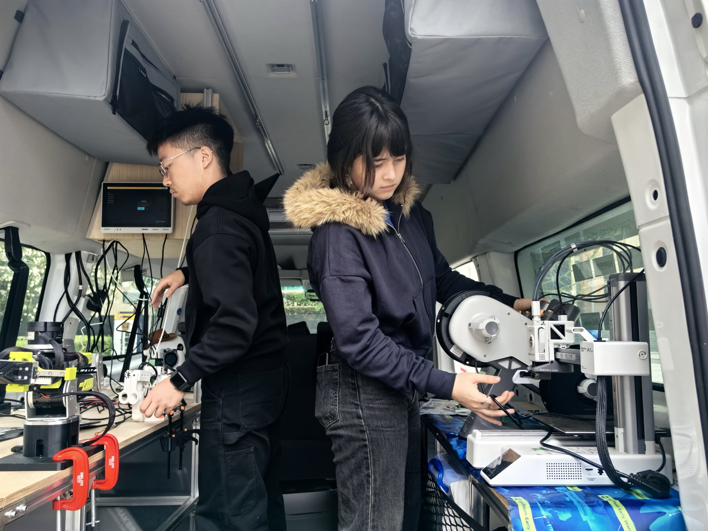
    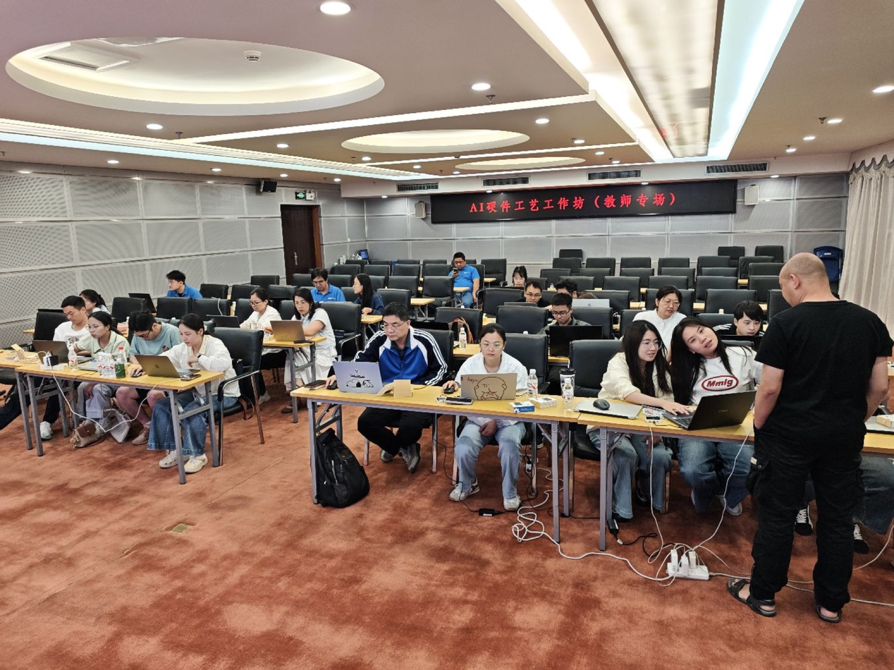
  

<!--
旁白：
基地车里面有两套东西。
一套是展示系统，让别人先看见 AI、机器人和开源硬件能做什么。
另一套是课程系统，让看见变成动手，尤其是 M0 到 M5 这样的训练路径。第一程我们重点跑的是 M0。
-->

---
layout: section
---

# 下一段路继续拓荒

作为 0 号车，普罗米修斯号应该去那些现场问题足够真实、值得一起解的地方。

  看不到技术可能性
  有明显信息差
  对 AI 还没有信心
  但问题足够具体

<!--
旁白：
下一段路还没有固定答案，这一点很重要。
0 号车应该去的地方，不一定是最热闹的地方，而是问题足够真实、信息差足够明显、也有人愿意一起解题的地方。
如果一个地方已经有成熟资源，我们不一定是最需要出现的人。
-->

---
layout: media
---

  <h1>你可以怎么参与</h1>
  
下一程不是等标准答案出现，而是找愿意一起把现场跑通的人。

  

    <b>领队</b>
    <strong>把路线跑顺</strong>
    
负责路线、现场节奏和资源协调，对接地方伙伴和活动安排。

  

  

    <b>技术担当</b>
    <strong>把方案跑通</strong>
    
方案设备部署和运维，技术布道和工作坊支持，把玩法变成可复用方案。

  

  

    <b>媒体担当</b>
    <strong>把故事留下来</strong>
    
记录现场故事，活动宣发，社区运营和后续传播。

  

如果你想参与某一段，直接来找我们认领一段路。

<!--
旁白：
最后回到参与方式。下一程需要的不只是技术同学。
领队要把路线和现场节奏跑顺，技术担当要把方案和设备跑通，媒体担当要把现场故事留下来。
如果你不是全程参与，也可以只认领其中一段。重点是把一个真实现场跑通。
-->

---
layout: end
---

# 拓荒，是把火种带到真实问题里。

柴火数字基地车，开到哪里，哪里就是基地。

官网：<a href="http://mcv.chaihuo.org" target="_blank" rel="noopener noreferrer">mcv.chaihuo.org</a> 
语雀：<a href="https://www.yuque.com/mouseart/mcv" target="_blank" rel="noopener noreferrer">yuque.com/mouseart/mcv</a> 
小红书：<a href="https://www.xiaohongshu.com/user/profile/69523906000000000300d495" target="_blank" rel="noopener noreferrer">柴火数字基地车</a>

<!--
旁白：
收尾可以回到一句话：拓荒不是证明我们有多先进，而是把火种带到真实问题里。
如果这辆车能让一个老师、一个新农人、一个学生开始尝试，那这段路就有意义。
谢谢大家。
-->
